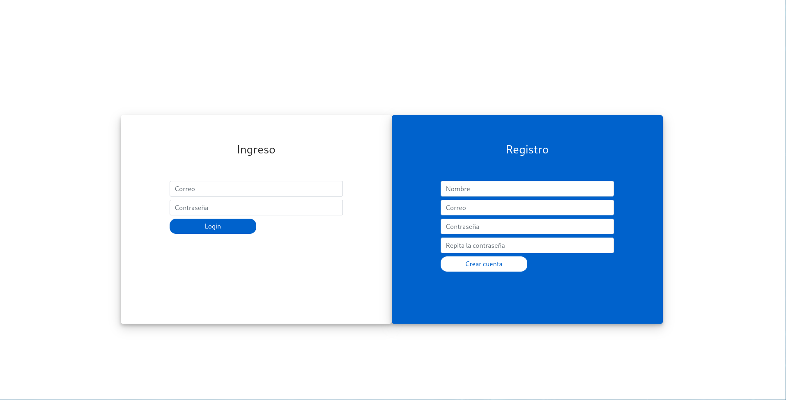
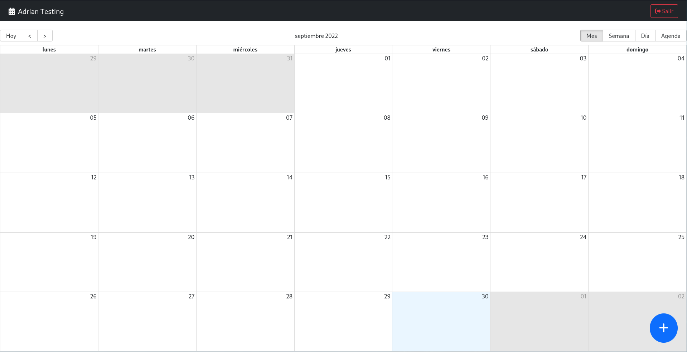
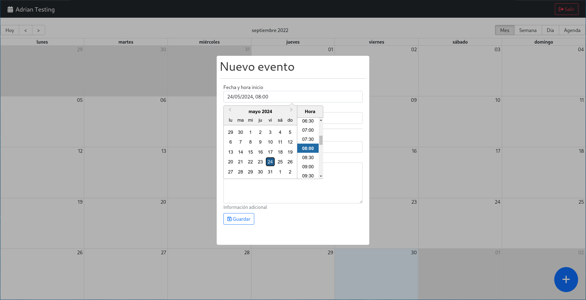

# Calendar App: MERN APP

This is a basic fullstack project that includes the MERN stack.

## Features included in this project

- React.js v18
- React Router DOM v6
- React Redux Toolkit
- Vite
- Testing with Jest & React Testing Library

## Running the app

```
# install dependencies
yarn
npm i

# run in dev mode on port 5173
yarn dev
npm run dev

# run tests
yarn test
npm i run test
```

# What are the functionalities of this project?

## Authentication

This project uses the JWT authentication methodology.

## Store

Store is handled with Reac Redux Toolkit

## View demo

You can log in with:
  - User 1: `adrian@test.com` and password `test123`.
  - User 2: `adrian2@test.com` and password `test123`.

[Demo](https://calendar-mern-alxs.netlify.app)

## Backend

[GitHub](https://github.com/AlexMartin998/calendar-backend-node)

### Screenshots




